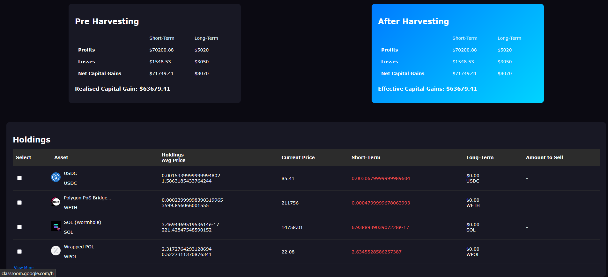
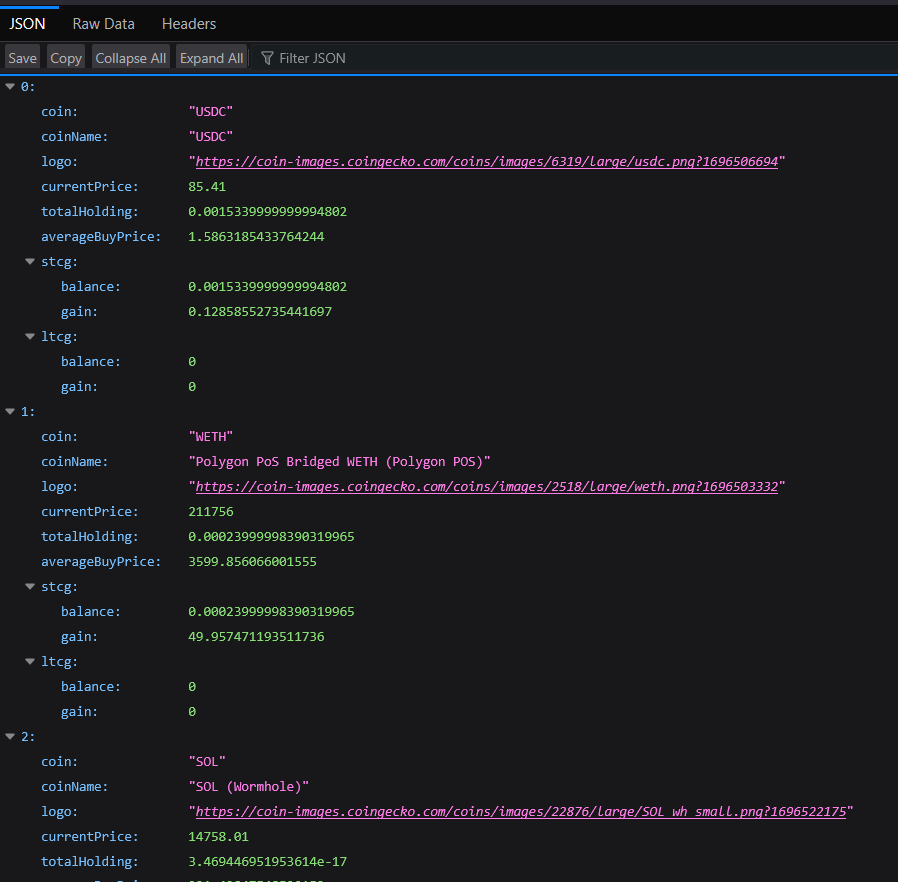

# 📊 Tax Harvesting Dashboard

A React-based dashboard for visualizing and managing crypto holdings with a focus on tax-harvesting insights. Users can monitor short-term and long-term gains, filter holdings, and simulate capital gains impact before and after harvesting.

---

## 🚀 Features

- 🔍 **View Holdings**: Displays detailed information for each crypto asset including:
  - Holdings & Avg Buy Price
  - Current Market Price
  - Short-Term and Long-Term Capital Gains
  - Gain Balances
- 📈 **Sorting**: Sort assets by current market price.
- ✅ **Selection**: Select individual assets for analysis/simulation.
- 📋 **View All Toggle**: Show full asset list or limit view to top 4.
- 📉 **Pre-Harvesting / After-Harvesting Tables**: Track projected outcomes.

---

## 🛠️ Tech Stack

- **React** – Component-based UI
- **CSS Modules** – Component-level styling
- **JavaScript (ES6)** – Core logic and interactivity

---

## 📦 Installation

1. **Clone the repo**
   ```bash
   git clone https://github.com/your-username/tax-harvesting-dashboard.git
   cd tax-harvesting-dashboard
   ```

2. **Install dependencies**
   ```bash
   npm install
   ```

3. **Start the development server**
   ```bash
   npm start
   ```

---

## 🔗 Live Demo

- 🌐 [Live Site](https://react-tax-optimization-xqeo.vercel.app/)

---

## 🔗 Backend API Endpoints

- `GET /coins` → [https://react-tax-optimization-z1jq.vercel.app/coins](https://react-tax-optimization-z1jq.vercel.app/coins)
  - Get all coin information

- `GET /coins/:coin` → [https://react-tax-optimization-z1jq.vercel.app/coins/:coin](https://react-tax-optimization-z1jq.vercel.app/coins/:coin)
  - Get information for a specific coin

- `GET /capital-gains` → [https://react-tax-optimization-z1jq.vercel.app/capital-gains](https://react-tax-optimization-z1jq.vercel.app/capital-gains)
  - Get information about capital gains

---

## 📷 Screenshot




---

## 🧪 Development Notes

- Use the **`Holdings.js`** component to pass `data` via props (each entry should contain coin, coinName, price, logo, gains, etc.)
- Modify sorting or selection logic inside `Holdings.js` if needed.
- Extend "PreHarvesting" or "AfterHarvesting" components to integrate APIs or financial models.

---

## 📄 License

This project is licensed under the [MIT License](LICENSE).
